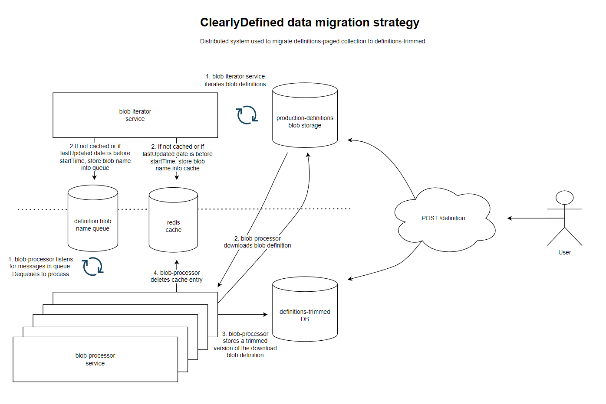

# Migration script to trim definitions-paged

## Goal:

Migrate all blob records to definitions-trimmed collection if record does not yet exist in definitions-trimmed collection

## 

## App Insights log contexts

-   `App`
-   `MongoService`
-   `RedisService`
-   `MigrationService`
-   `AzureBlobService`

## To Run

-   `npm install`
-   `npm run build`
-   Configure environment variables
-   `npm start`
